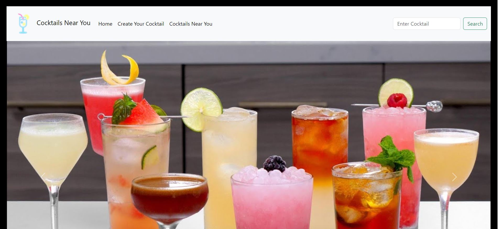
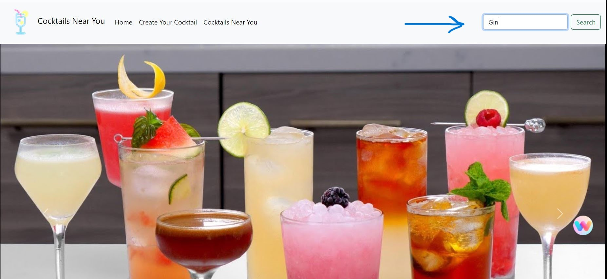
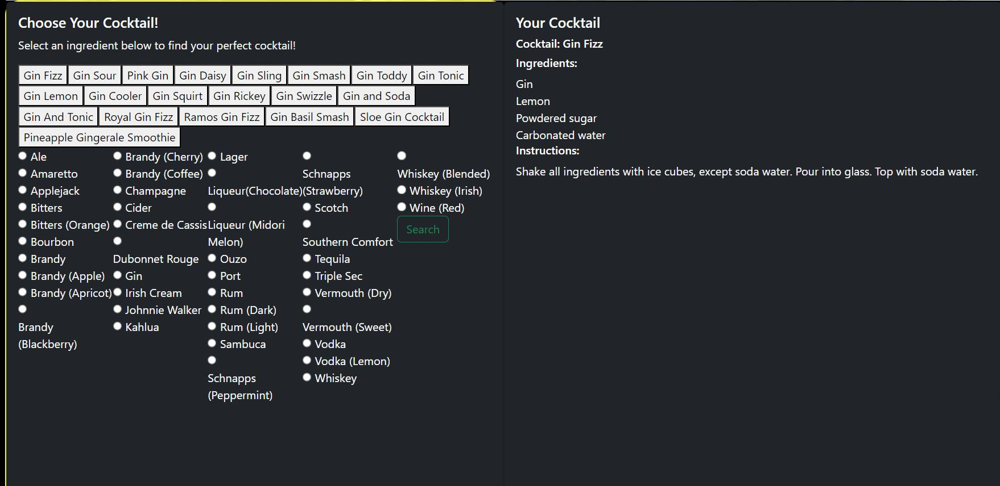

# [Cocktails Near You](https://danielharding1.github.io/Whats_Near_You/)

## Table of Contents

| Contents                                |
| --------------------------------------- |
| [Description](#description)             |
| [Installation](#installation)           |
| [Usage](#usage)                         |
| [Credits](#credits)                     |
| [Liscence](#license)                    |
| [Features](#features)                   |
| [How to Contribute](#how-to-contribute) |

## Description

A cocktail creation site that suggests which cocktails you can create based on which ingredients you have in your cupboard at home. The site will also tell you the location of local restaurants and what time they open and close.

### User Story

I want to be able to make a cocktail after inputting the ingredients that I have in my kitchen and I would like to find local places which serve food or drink.

### Accepance Criteria

The project is complete when the user can search for an ingredient and a list of possible cocktails is displayed, and they can search near locations on the map.

## Installation

This application is available on a web browser at [Cocktails Near You](https://danielharding1.github.io/Whats_Near_You/).

To access the Google Maps API please download it here.

## Usage

### Step 1:

Click this [link](https://danielharding1.github.io/Whats_Near_You/) to open _Cocktails Near You_ in your browser.

### Step 2:

In the top right corner type a drink you would like to make in the search bar and click 'Search'.

### Step 3:

Scroll down on the page to see what drinks you can make based on your searched item. In this case, 'Gin' returns 20 possible cocktail recipes!

### Step 4:

You can also use this application by selecting your desired mixer and searching that way.

To do this, select your item and click search.

In this example, we will select 'Tequila' and click search.

All drinks containing the ingredient 'Tequila' will now be displayed on the page.

### Step 5

Now you have chosen your drink, choose from the list of recipes to learn the ingredients and how you can make it!

In this example we have chosen 'Tequila' and have selected the '3-Mile Long Island Iced Tea', as shown below:

### Step 6:

Use the map to search for cocktail bars near you!

### Map Navigation

Please see the following diagram demonstrating how to navigate the map using the buttons in the bottom left corner of the page.

## Credits

### Follow the collaborators of this project on Github:

| Collaborators   | Links                                       |
| --------------- | ------------------------------------------- |
| Daniel Harding  | [Github](https://github.com/DanielHarding1) |
| Chelsea Chapman | [Github](https://github.com/chelsea32568)   |
| Imogen Coughlin | [Github](https://github.com/imogenc0)       |

### APIs Used:

If you used any third-party assets that require attribution, list the creators with links to their primary web presence in this section.

If you followed tutorials, include links to those here as well.

## License

MIT Liscence (see liscencing for more details)

## Features

If your project has a lot of features, list them here.

## How to Contribute

If you created an application or package and would like other developers to contribute it, you can include guidelines for how to do so. The [Contributor Covenant](https://www.contributor-covenant.org/) is an industry standard, but you can always write your own if you'd prefer.
